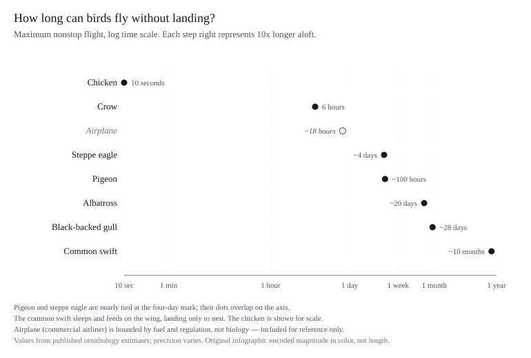
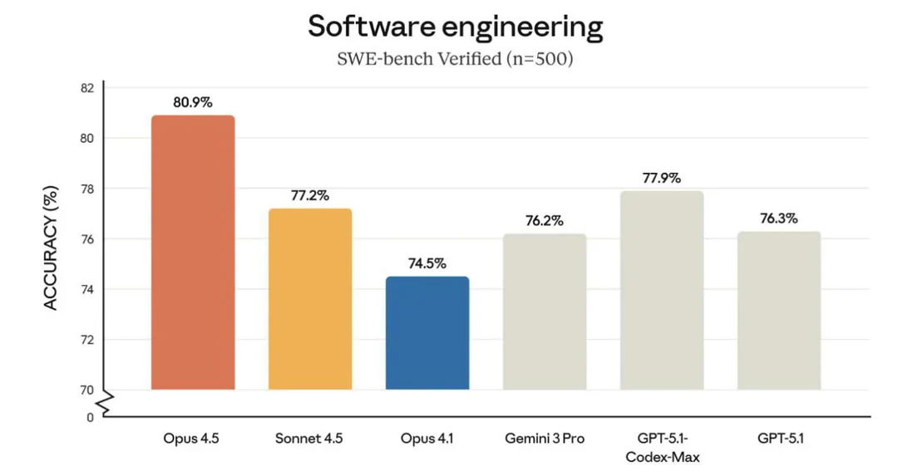
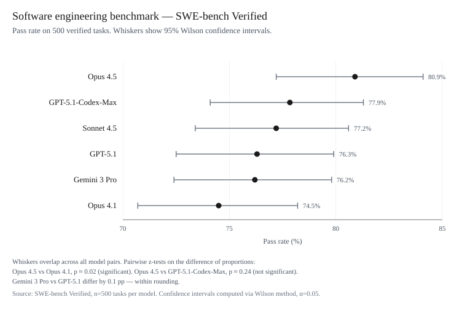

# tufte-vdqi

> Give your AI agents the skill of visualizing data the way Edward Tufte intended.

<p align="center">
  
</p>

*Based on Edward Tufte's* The Visual Display of Quantitative Information

---

Every chart your agent produces gets scored against Tufte's principles — lie factor measured, chartjunk stripped, redundant ink removed, labels moved inline, axes replaced with range-frames, monetary values inflation-adjusted, and the result rendered as a clean SVG. Not as a suggestion. As a workflow.

---

## Before / After

<table>
<tr>
<th align="center">Before</th>
<th align="center">After</th>
</tr>
<tr>
<td></td>
<td></td>
</tr>
<tr>
<td></td>
<td></td>
</tr>
</table>

Same data, both times. No decorative bars, no arbitrary colors. Cleveland dot plots that let the actual signal — and the uncertainty — speak for itself.

---

## Install

The two skills follow the open [SKILL.md agent-skills standard](https://agentskills.io), so they work in any harness that reads it. Each skill directory is self-contained (scripts, reference, assets included) and can be installed on its own.

**Claude Code**

```
/plugin marketplace add gnurio/tufte-vdqi-plugin
/plugin install tufte-vdqi
```

**Claude Desktop / Cowork**

1. Open Claude Desktop → Cowork tab → **Plugins**
2. Add this repo as a plugin source (or upload it as a ZIP)

*Requires a paid Claude plan with Cowork enabled. Org admins: Organization Settings → Plugins → GitHub source → paste this repo URL.*

**Codex CLI**

```
git clone https://github.com/gnurio/tufte-vdqi-plugin
cp -r tufte-vdqi-plugin/skills/* ~/.codex/skills/
```

**OpenCode**

```
git clone https://github.com/gnurio/tufte-vdqi-plugin
cp -r tufte-vdqi-plugin/skills/* ~/.config/opencode/skills/
```

**Any other SKILL.md-compatible agent** (Cursor, Gemini CLI, Copilot, …)

Copy the directories under `skills/` into wherever your tool discovers skills. Scripts need only Python 3 — no dependencies.

---

## Skills

Two skills, one VDQI-sourced reference. The principles file (mirrored into both skills so each installs standalone) is the source-grounded encoding of Tufte's specific techniques — a nine-criterion rubric with numeric anchors, ten chart genres with construction recipes, a chartjunk taxonomy, 13+14 named anti-pattern/exemplar catalogues, and the friendly-graphic checklist — all cited to VDQI by page.

| Skill | What it does |
|-------|-------------|
| `tufte-critique` | Scores a graphic against a nine-criterion VDQI rubric with numeric anchors, names the chartjunk species present (moiré, dreaded grid, duck, decoration), computes lie factor and compares to VDQI's catalogue (14.8 NYT MPG, 59.4 TIME barrel "a record", etc.), checks whether the data wants a different genre (table for ≤20 numbers, small multiples for many series, range frame instead of bordered scatter), and emits fixes tagged with remedy / genre / anti-pattern resemblance / exemplar to emulate. |
| `tufte-chart` | Produces an actual SVG using Tufte's specific genres. Ships per-genre scripts for time-series, small multiples, the quartile plot (Tufte's stripped-down box plot), and range-frame scatter (with optional dot-dash marginals), plus an HTML wrapper using the bundled tufte-css. |

Ships with helper scripts and the [tufte-css](https://github.com/edwardtufte/tufte-css) typography bundle (MIT, vendored under `skills/tufte-chart/assets/tufte-css/`):

- `scripts/deflate.py` (both skills) — inflation adjustment for monetary time series. Requires real CPI values; errors on a missing year rather than guessing.
- `tufte-chart/scripts/render_line_svg.py` — Tufte-style time-series line chart (VDQI C10).
- `tufte-chart/scripts/small_multiples.py` — grid of identical mini-charts sharing one scale (VDQI C5).
- `tufte-chart/scripts/quartile_plot.py` — Tufte's stripped-down box plot (VDQI C1, pp.124–125).
- `tufte-chart/scripts/range_frame.py` — scatterplot with axis lines spanning only the data range (VDQI C2, pp.130–132); pass `--marginal-dash` for the dot-dash plot (C3, p.133).
- `tufte-chart/scripts/wrap_html.py` — wraps an SVG in a Tufte-styled HTML page using the vendored ET Book typography; copies the stylesheet and fonts next to the output so it opens in any browser with no network. Every SVG is inspected before inlining; script-bearing content is refused.

All scripts run with plain `python3` and the standard library.

---

## Usage

Just ask in natural language — the skills fire on intent:

- "Is this chart any good?" / "Is this graph misleading?" → `tufte-critique`
- "Make me a Tufte chart of this data" / "Visualize this" → `tufte-chart`
- "Clean up this cluttered plot" → critique, then rebuild

In Claude Code you can also invoke them directly as slash commands: `/tufte-critique`, `/tufte-chart`.

---

## Common workflows

### "Is this chart any good?"
```
tufte-critique       → nine-criterion scores, lie factor, prioritised fixes (B1–B7)
```

### "Fix this cluttered or misleading chart"
```
tufte-critique       → diagnose and emit remedies
tufte-chart          → rebuild honoring those remedies
```

### "Design a chart from scratch"
```
tufte-chart          → produces an SVG that bakes in B1–B7 by construction
tufte-critique       → (optional) confirm the result scores well
```

### "My data is currency across multiple years"
```
deflate.py (B7)      → convert to real <base-year> dollars first
tufte-chart          → plot the real-terms series with a labelled axis
```

### "Give me a shareable Tufte-styled web page, not just an SVG"
```
tufte-chart          → produces chart.svg
wrap_html.py         → wraps it in a tufte-css page (ET Book typography)
                       → outputs chart.html + ./tufte-assets/ siblings
```

### "I have many series to compare"
```
small_multiples.py   → grid of identical mini-charts, shared scales
                       ("inevitably comparative, deftly multivariate" — VDQI p.170)
```

### "I want to compare distributions across groups"
```
quartile_plot.py     → Tufte's stripped-down box plot (VDQI pp.124–125)
                       erased box; offset IQR; median tick
```

### "I want a scatter that doesn't lie about the data range"
```
range_frame.py                 → axis lines span only data min..max (VDQI pp.130–132)
range_frame.py --marginal-dash → adds dot-dash marginals (VDQI p.133)
```

---

## License

Concepts in this project were inspired by *The Visual Display of Quantitative Information* by Edward Tufte. No text has been reproduced.
