# Chartwright

> Give your AI agents the skill of visualizing data the way Edward Tufte intended.

<p align="center">
  
</p>

*Based on Edward Tufte's* The Visual Display of Quantitative Information

---

Every chart your agent produces gets scored against Tufte's principles — lie factor measured, chartjunk stripped, redundant ink removed, labels moved inline, axes replaced with range-frames, monetary values inflation-adjusted, and the result rendered as clean HTML. Not as a suggestion. As a workflow.

---

## Before / After

<table>
<tr>
<th align="center">Before</th>
<th align="center">After</th>
</tr>
<tr>
<td></td>
<td></td>
</tr>
</table>

Same data. No bird illustrations, no rainbow bars, no chartjunk. A Cleveland dot plot on a log scale that lets the six-order-of-magnitude spread speak for itself.

---

## Install

**Individual (Claude Code)**

1. Open Claude Desktop → switch to the Cowork tab
2. Go to **Plugins**
3. Add this repo as a plugin source
4. Upload the ZIP file

**Organization (admin)**

1. Go to Organization Settings → Plugins
2. Select **GitHub** as the source
3. Paste this repo URL
4. Set market preference: Required / Available / Default

*Requires a paid Claude plan (Pro, Max, Team, or Enterprise) with Cowork enabled.*

---

## Skills

| Skill | What it does |
|-------|-------------|
| `orchestrate-tufte-vdqi` | Describe your chart challenge — gets routed to the right skills automatically |
| `assess-graphical-excellence` | Score a graphic against Tufte's nine criteria for graphical excellence |
| `calculate-lie-factor` | Measure the ratio of visual distortion to actual data change |
| `erase-non-data-ink` | Remove decoration, borders, and fills that carry no information |
| `erase-redundant-data-ink` | Eliminate repeated encodings of the same datum |
| `standardize-monetary-units` | Convert nominal dollars to inflation-adjusted constants for time-series |
| `generate-range-frames` | Replace rectangular plot frames with range-frames that span actual data |
| `integrate-text-and-graphic` | Place labels and captions directly in the plotting field |
| `construct-small-multiples` | Compose paneled graphics sharing a design, varying one variable |
| `render-tufte-chart` | Render data as a complete Tufte-styled HTML chart with inline CSS |

---

## Usage

Start with the orchestrator — it detects your intent and routes you:

```
/orchestrate-tufte-vdqi
```

Or invoke skills directly:

```
/calculate-lie-factor
/assess-graphical-excellence
/render-tufte-chart
```

---

## Common workflows

### "My chart looks wrong"
```
assess-graphical-excellence   → find what's failing
calculate-lie-factor          → check for distortion
erase-non-data-ink            → strip the decoration
erase-redundant-data-ink      → simplify the encoding
```

### "I need to redesign a chart from scratch"
```
assess-graphical-excellence   → baseline score
generate-range-frames         → replace the heavy frame
integrate-text-and-graphic    → move labels inline
construct-small-multiples     → if comparing across groups
render-tufte-chart            → output clean HTML
```

### "My data has monetary values over time"
```
standardize-monetary-units    → inflation-adjust first
generate-range-frames         → clean the axes
integrate-text-and-graphic    → direct labeling
render-tufte-chart            → render the result
```

---

## License

Based on Edward Tufte's *The Visual Display of Quantitative Information* and subsequent works. MIT License.
